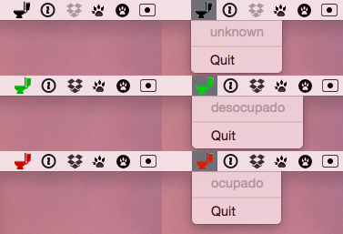

# ocupado-app

An OSX toolbar app build using [atom-shell](https://github.com/atom/atom-shell)
that displays the current state of the
[Ocupado](https://github.com/brentertz/ocupado) bathroom occupancy detector.



### Installation

Clone the Github repo and install dependencies.

```
git clone 'git@github.com:brentertz/ocupado-app.git'
cd ocupado-app
npm install
grunt build
```

### Configure

Configuration options are stored in ocupado-app/config/default.js. To override
values, add a (already) gitignored ocupado-app/config/local.js file.

### Start

```
npm start
```

### Debug

```
npm install -g node-inspector
node-inspector
open http://127.0.0.1:8080/debug?port=5858
npm run debug
```

### Create a release

```
grunt dist
```
